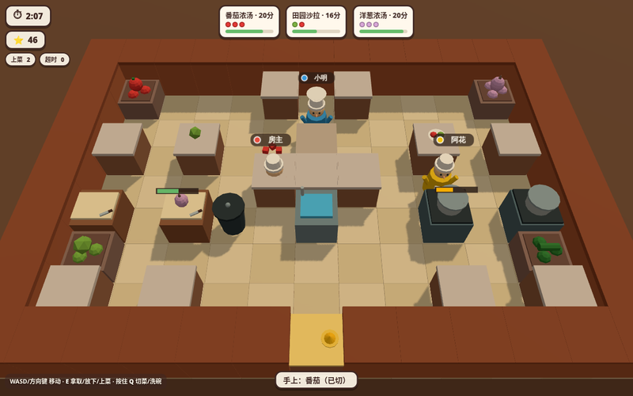

# 胡闹厨房派对（Overcooked Party）— Parti 多人联机房间

Low-poly 3D 合作厨房 chaos，可直接导入 [Parti](https://github.com/glink25/Parti) 的联机房间包。
2-4 名厨师在限定时间内分工完成 **取菜 → 切菜 → 煮汤 → 装盘 → 上菜 → 洗碗** 的完整流程，挑战高分。



## 玩法

- **人数**：2-4 人（合作），房主权威同步
- **目标**：180 秒内完成尽可能多的订单。按时上菜得分（剩余时间越多小费越高），订单超时扣分
- **三张地图**：
  - 🍳 **经典厨房**：左右对称的新手厨房，动线宽敞
  - 🧱 **一线天**：台面高墙把厨房劈成两半，只有一条通道，需要隔空递菜
  - 🎡 **环岛餐吧**：灶台集中在中央环岛，五种菜谱全开，订单更密
- **五种菜谱**：番茄浓汤 / 洋葱浓汤 / 菌菇浓汤（需切碎后下锅煮）· 田园沙拉 / 豪华沙拉（切碎直接装盘）
- **厨房事故**：汤煮好不及时取会**烧糊**（空手去灶台倒掉）；上菜后**脏盘子**会回到水槽，需要及时清洗，否则没盘可用

## 操作

| 平台 | 移动 | 拿取 / 放下 / 上菜 | 切菜 / 洗碗 |
| --- | --- | --- | --- |
| 键盘 | WASD / 方向键 | E / 空格 / J | 按住 Q / F / K |
| 触屏 | 虚拟摇杆 | 「互动」按钮 | 长按「切/洗」按钮 |

## 房间包结构（构建产物 `dist/`）

```
parti.room.json   # manifest（packageMode: blob）
index.html        # 单文件 3D UI（three.js 全量内联）
room.worker.js    # 权威房间逻辑（defineRoom 单文件）
cover.png         # 市场卡片封面
```

架构遵循 Parti 文档约束：Worker 持有唯一权威状态（10Hz tick + 全量快照），客户端仅通过
`parti.action` 提交意图（move / work / interact / selectMap / start / rematch / toLobby），
在 `parti.onState` 中驱动渲染，本机玩家带客户端预测与插值。

## 本地开发

```bash
npm install
npm run build        # 产出 dist/（Room Package）并打包 worker
npm run verify       # 运行 verifier/v1：manifest 校验 + worker 契约 + 全流程逻辑模拟 + 产物检查
```

浏览器直开 `dist/index.html#demo` 可看 3D 演示画面（无 Runtime 的静态快照模式）。
真实联机调试：把 `dist/` 内容放进 Parti 仓库 `apps/web/public/rooms/overcooked-party/` 后 `pnpm dev`。

## 发布

推送 `v*` tag 触发 GitHub Actions：构建 → 生成 `parti.room.zip` + `parti.room.json` release 资产 →
推送 `dist/` 到 `parti-package` 分支（房间市场安装通道）。市场登记 issue 标题：
`[parti-room] glink25/parti-overcooked@parti-package`。
